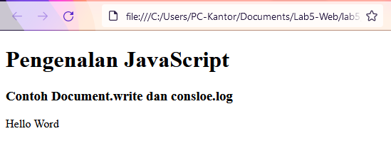
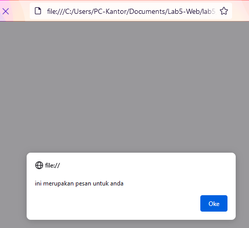
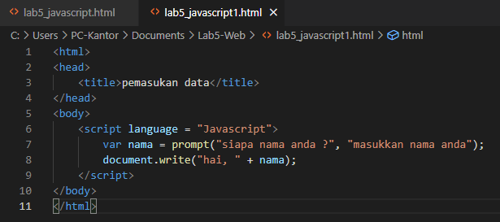
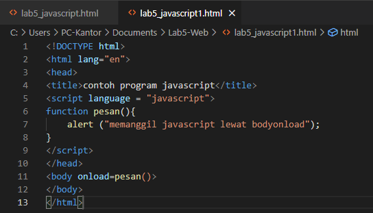
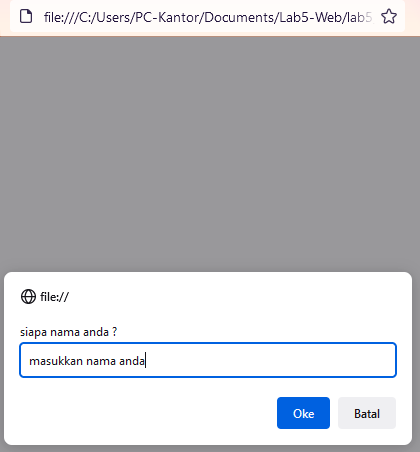
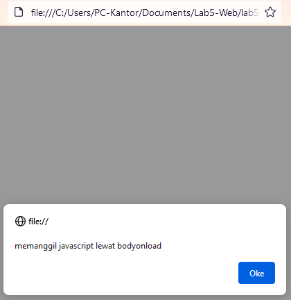
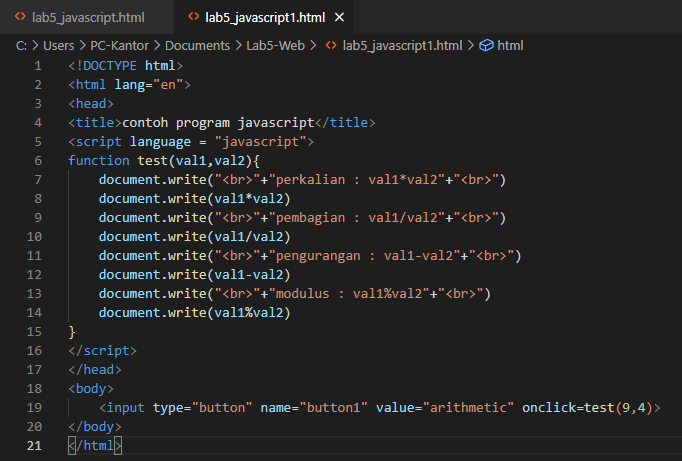
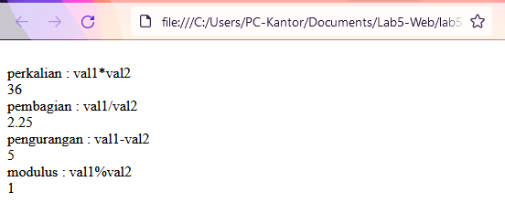

# Lab5-Web

Nama : M. Aqil Al Farid 
NIM : 312010140 
Kelas : TI.20.B.1 

# TUGAS

Berikut adalah hasil HTML 
 
Dan ini hasil dari HTML tersebut 
 

# JAVASCRIPT DASAR

### Pemakaian Alert sebagai property window. 
 
Dan ini Hasilnya 
 

### Pemakaian method dalam objek. 
 
Dan ini Hasilnya 
 

### Pemaikaian prompt. 
 
Dan ini Hasilnya 
 

### Pembuatan Fungsi dan Cara Pemanggilannya Berikut adalah htmlnya. 
 
Dan ini Hasilnya 
 

# Dasar Pemrograman di Javascript

### Operasi dasar aritmatika
 
