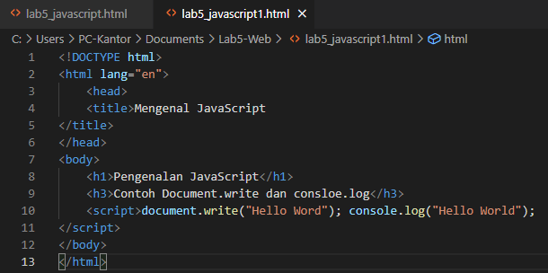
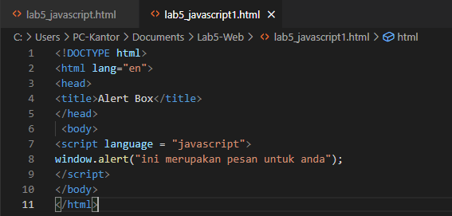

# Lab5-Web

Nama : M. Aqil Al Farid 
NIM : 312010140 
Kelas : TI.20.B.1 

# TUGAS

Berikut adalah hasil HTML 
 
Dan ini hasil dari HTML tersebut 
 

# JAVASCRIPT DASAR

### Pemakaian Alert sebagai property window. 
 
Dan ini Hasilnya 
 

### Pemakaian method dalam objek. 
 
Dan ini Hasilnya 
 

### Pemaikaian prompt. 
 
Dan ini Hasilnya 
 

### Pembuatan Fungsi dan Cara Pemanggilannya Berikut adalah htmlnya. 
 
Dan ini Hasilnya 
 

# Dasar Pemrograman di Javascript

### Operasi dasar aritmatika 
 
Dan ini Hasilnya 
 

### Seleksi kondisi (if..else) 
 
Dan ini hasilnya 
 
Hasil ini LULUS
 
Hasil ini TIDAK LULUS

# PEMBUATAN FORM

### Form Input 
 
Dan ini Hasilnya 
 
 

### Form Buttom 
 
Dan ini Hasilnya 
 
 
 
 

# HTML DOM

### Pilihan menggunakan checkBox dengan perhitungan otomatis 
 
Dan Ini Hasilnya
 

Sekian Pertemuan Kali ini , TERIMA KASIH.

# PERTANYAAN TUGAS
 

Berikut HTMLnya 
 
Dan berikut hasilnya : 
 

